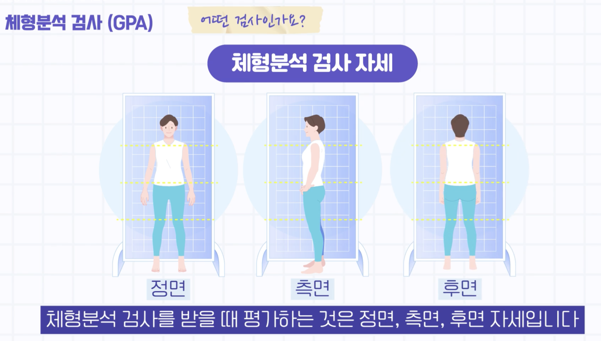
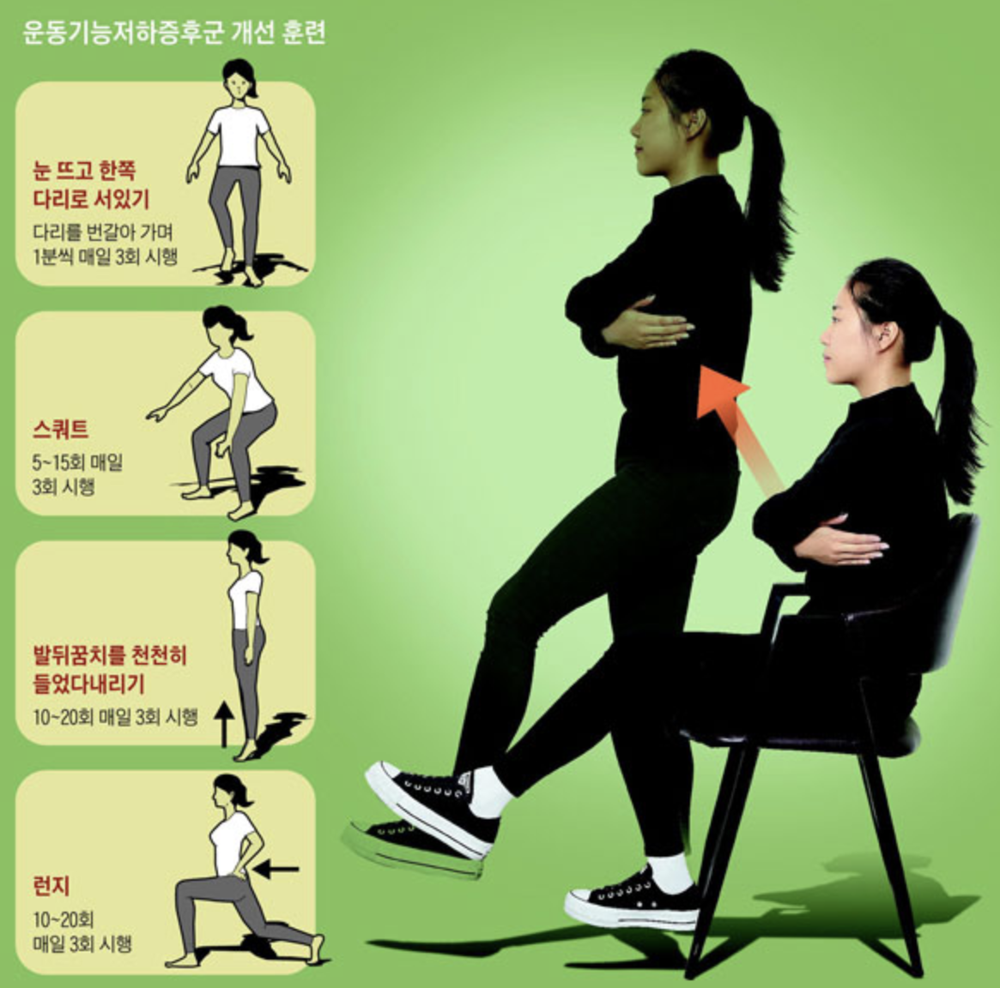

PROJECT2
# EXERCISE 
---
## PROJECT LOGO

## 1. 프로젝트 정보
---
* This is an APP development project that identifies an individual's physical characteristics through images or videos of a few specific movements and provides/manages an appropriate exercise curriculum.

* 몇가지 특정 동작들을 이미지 또는 영상으로 개인의 신체 특성을 파악하여 적합한 운동 커리큘럼을 제공/관리 해주는 APP 개발 프로젝트 입니다
---

## 2. 팀 소개
---
|최현우|

---

## 3. 프로젝트 소개 (진행 이유)
---

* This is an app that allows individuals to diagnose vulnerable parts of the body through specific movements using images or videos by connecting them to a cell phone or simple hardware, and provides/manages an exercise curriculum appropriate for the diagnosis.

* In modern times, I think we live in an era where people enjoy and participate in various social sports (golf, baseball, soccer, fitness, etc.) and focus on self-management. Even though I want to do well, there are frequent injuries and the inconvenience of having to spend a lot of money and time to learn. Since I have experienced this countless times, I believe that I will be able to further resolve users' difficulties.

* 개인이 핸드폰 또는 간단한 하드웨어와 접목하여 이미지 또는 영상으로 *특정동작(아래 이미지 참조)으로 신체의 취약 부분을 진단하여, 진단에 맞는 운동 커리큘럼을 제공/관리 해주는 앱 입니다.

* 현대에 이르러서 다양한 사회인 운동(골프, 야구, 축구, 헬스 등)을 즐기고 참여하고 자기 관리에 집중하는 시대라고 생각합니다. 잘하고자 하는 마음에 부상도 잦고 목돈과 시간을 들여서 배워야 하는 불편한 점이 있습니다. 이러한 점을 본인도 수없이 겪어보았기 때문에 유저의 고충을 더욱 해소 시켜줄 수 있을거라고 생각합니다.
 
---

## 4. 기술 스택
---

---

## 5. 주요 기능
---

* **CV**, **NeRF(Neural radiance Fields)NeRF(Neural radiance Fields)**, **Image To Text**, use models and extract features from labeled data to learn to classify images We are planning to introduce a function to recognize/classify images in this way. Although it is currently being medically researched, we are trying to develop it in a light way tailored to each individual.

* **CV**, **NeRF(Neural radiance Fields)NeRF(Neural radiance Fields)**, **Image To Text**, 모델들을 이용하고 labeled data를 가지고 특징을 추출하여 영상을 분류하는 학습을 수행하는 방식으로 영상을 인식/분류 하는 기능을 도입 해보려고 합니다. 현재 의학적으로 연구되고 있지만 개인에 맞게 라이트하게 개발을 해보려고 합니다

* 특정 동작 (신체 진단을 위한 동작 예시)_체형 분석 검사 데이터(GPA) 참조
   1. 정면, 측면, 후면
        
   2. 운동 기능 저하 진단
        
   3. 링크 참조 [헬스 셀프 진단 자세](https://www.etoday.co.kr/news/view/1881909)

---

 ---
 1. Take photos and videos of specific actions
 2. Diagnosis of basic body type and posture
 3. Select desired applicable item
 4. Select the desired posture, technique, etc.
 5. Take photos in a position that suits your purpose
 6. Print after diagnosis
 7. Provide curriculum tailored to diagnosis
 ---
 ---
 1. 특정 동작 사진 및 영상 촬영
 2. 기본 체형, 자세에 대한 진단
 3. 원하는 적용 종목 선택
 4. 원하는 자세, 기술 등 목적 선택
 5. 본인의 목적에 맞는 자세 촬영
 6. 진단 후 출력
 7. 진단에 맞는 커리큘럼 제공
 ---

## 6. 아키텍처 (분할형 아키텍처)
---

---
## 7. 사용할 수 있는 비전
---

---